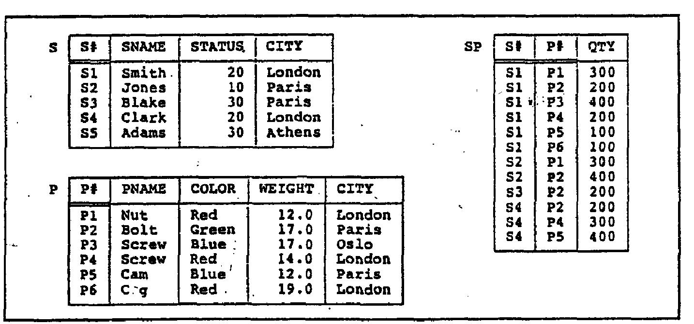

2.6 List the employees who have BLAKE as their manager.

```mysql
SELECT worker.ename, manager.ename
FROM emp2021192010 worker, emp2021192010 manager
WHERE worker.mgr = manager.empno AND manager.ename = 'BLAKE';
```


6.6 Find all the employees that earn more than the average salary of employees in their department.

```mysql
SELECT e.ename
FROM emp2021192010 e, (SELECT deptno, AVG(sal) avgSal FROM emp2021192010 GROUP BY deptno) d
WHERE e.deptno = d.deptno AND e.sal > d.avgSal;
```




```mysql
CREATE DATABASE exp2;
USE exp2;

CREATE TABLE S2021192010 (
		S VARCHAR(2), 
		SNAME VARCHAR(10),  
		STATUS NUMERIC, 
  	CITY VARCHAR(10), 
		PRIMARY KEY (S)
) ENGINE = InnoDB;

INSERT INTO S2021192010 VALUES
('S1', 'Smith', 20, 'London'), 
('S2', 'Jones', 10, 'Paris'),
('S3', 'Blake', 30, 'Paris'),
('S4', 'Clark', 20, 'London'),
('S5', 'Adams', 30, 'Athens');

SELECT * FROM `S2021192010`;

CREATE TABLE P2021192010 (
		P VARCHAR(2), 
		PNAME VARCHAR(10),  
		COLOR VARCHAR(10),  
		WEIGHT FLOAT(2, 1), 
  	CITY VARCHAR(10), 
		PRIMARY KEY (P)
) ENGINE = InnoDB;

INSERT INTO P2021192010 VALUES
('P1', 'Nut', 'Red', 12.0, 'London'), 
('P2', 'Bolt', 'Green', 17.0, 'Paris'), 
('P3', 'Screw', 'Blue', 17.0, 'Oslo'), 
('P4', 'Screw', 'Red', 14.0, 'London'), 
('P5', 'Cam', 'Blue', 12.0, 'Paris'), 
('P6', 'Cg', 'Red', 19.0, 'London');

SELECT * FROM `P2021192010`;

CREATE TABLE SP2021192010 (
		S VARCHAR(2), 
  	P VARCHAR(2), 
		QTY NUMERIC(3, 0),
		FOREIGN KEY (S) REFERENCES S2021192010(S), 
  	FOREIGN KEY (P) REFERENCES P2021192010(P)
) ENGINE = InnoDB;

INSERT INTO SP2021192010 VALUES
('S1', 'P1', 300),
('S1', 'P2', 200),
('S1', 'P3', 400),
('S1', 'P4', 200),
('S1', 'P5', 100),
('S1', 'P6', 100),
('S2', 'P1', 300),
('S2', 'P2', 400),
('S3', 'P2', 200),
('S4', 'P2', 200),
('S4', 'P4', 300),
('S4', 'P5', 400);

SELECT * FROM `SP2021192010`;
```


Get supplier numbers for suppliers who supply at least all those parts supplied by supplier S2, but not supplied by S3. 

S2有的我都有, S3有的我不要. 

```mysql
SELECT DISTINCT SP1.supplier_id FROM SP AS SP1
WHERE NOT EXISTS (
    SELECT P.part_id
    FROM SP AS SP2
    JOIN P ON SP2.part_id = P.part_id
    WHERE SP2.supplier_id = 'S2'
    EXCEPT
    SELECT P.part_id
    FROM SP AS SP3
    JOIN P ON SP3.part_id = P.part_id
    WHERE SP3.supplier_id = 'S3'
    EXCEPT
    SELECT P.part_id
    FROM SP AS SP4
    JOIN P ON SP4.part_id = P.part_id
    WHERE SP4.supplier_id = SP1.supplier_id
);
```


```mysql
SELECT DISTINCT s1.S FROM SP2021192010 s1 WHERE s1.S != 'S3' AND NOT EXISTS (
  	SELECT p.P FROM SP2021192010 p WHERE p.S = 'S2' AND NOT EXISTS
  	(SELECT s2.P FROM SP2021192010 s2 WHERE s2.P = p.P AND s2.S = s1.S)
);
```


```mysql
SELECT DISTINCT S1.SupplierNumber
FROM SP AS S1
WHERE S1.SupplierNumber <> 'S3'
  AND NOT EXISTS (
    SELECT P.PartNumber
    FROM SP AS P
    WHERE P.SupplierNumber = 'S2'
      AND NOT EXISTS (
        SELECT PS.PartNumber
        FROM SP AS PS
        WHERE PS.SupplierNumber = S1.SupplierNumber
          AND PS.PartNumber = P.PartNumber
      )
  );
```


```mysql
SELECT DISTINCT S1.SupplierNumber
FROM SP AS S1
WHERE S1.SupplierNumber <> 'S3'
  AND NOT EXISTS (
    SELECT P.PartNumber
    FROM SP AS P
    WHERE P.SupplierNumber = 'S2'
      AND NOT EXISTS (
        SELECT PS.PartNumber
        FROM SP AS PS
        WHERE PS.SupplierNumber = S1.SupplierNumber
          AND PS.PartNumber = P.PartNumber
      )
  );
```


```mysql
SELECT * FROM S s WHERE NOT EXISTS
(SELECT * FROM P p WHERE NOT EXISTS
(SELECT * FROM PS WHERE S = s.S AND P = p.P));
```


```mysql
SELECT * FROM S s WHERE NOT EXISTS
(SELECT * FROM P p WHERE color = 'Red' AND NOT EXISTS
(SELECT * FROM PS WHERE S = s.S AND P = p.P));
```


```mysql
SELECT SID FROM Student s WHERE
(SELECT * FROM Enrollment e GROUP BY SID WHERE s.SID = e.SID 
HAVING COUNT(DISTINCT CID) = (SELECT COUNT(*) FROM Course));
```

---

---


2.5 For each employee whose salary exceeds his manager's salary, list the employee's name and salary and the manager's name and salary. 

```mysql
SELECT worker.ename 'worker name', worker.sal 'worker salary', manager.ename 'manager name', manager.sal 'manager salary'
FROM emp2021192010 worker, emp2021192010 manager
WHERE worker.mgr = manager.mgr AND worker.sal > manager.sal;
```


6.3 List the name, job, and department of employees who have the same job as Jones or a salary greater than or equal to Ford.

```mysql
SELECT ename, job, deptno
FROM emp2021192010
WHERE 
(job = (SELECT job FROM emp2021192010 WHERE ename = 'JONES') AND ename != 'JONES')
OR (sal >= (SELECT sal FROM emp2021192010 WHERE ename = 'FORD') AND ename != 'FORD');
```


思考题

```mysql
CREATE DATABASE exp2;
USE exp2;

CREATE TABLE A2021192010 (
		sno VARCHAR(2), 
  	pno VARCHAR(2)
) ENGINE = InnoDB;

INSERT INTO A2021192010 VALUES
('s1', 'p1'), 
('s1', 'p2'), 
('s1', 'p3'), 
('s1', 'p4'), 
('s2', 'p1'), 
('s2', 'p2'), 
('s3', 'p2'), 
('s4', 'p2'), 
('s4', 'p4');

SELECT * FROM `A2021192010`;

CREATE TABLE B2021192010 (
  	pno VARCHAR(2)
) ENGINE = InnoDB;

INSERT INTO B2021192010 VALUES ('p2');

SELECT * FROM `B2021192010`;
```


```mysql
SELECT DISTINCT sno FROM A2021192010 seller WHERE NOT EXISTS
(SELECT * FROM B2021192010 part WHERE NOT EXISTS
(SELECT * FROM A2021192010 relation WHERE seller.sno = relation.sno AND part.pno = relation.pno));
```


```mysql
INSERT INTO B2021192010 VALUES ('p4');
```

---

---

Get supplier numbers for suppliers who supply at least all those parts supplied by supplier S2.

```mysql
SELECT DISTINCT s.S FROM S s
WHERE NOT EXISTS (SELECT p.P FROM SP sp1
		LEFT JOIN SP sp2 ON sp1.P = sp2.P AND sp2.S = s.S
		JOIN P p ON sp1.P = p.P WHERE sp1.S = 'S2'
);
```

---

---


